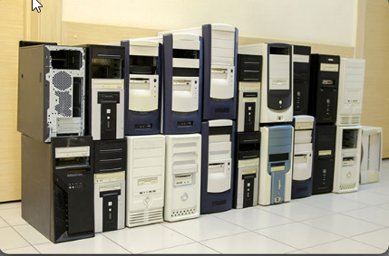
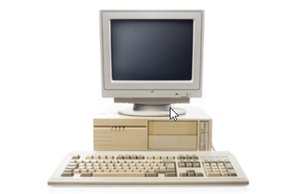
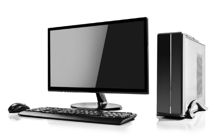
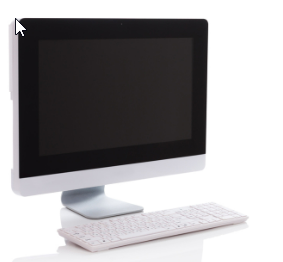

# Boitiers

**Le format du boiter dépend du format de la carte mère.**

Exemple:

## Boitier honrizontale

Exemple:

## Tour pleine grandeur

Exemple:

## Tour compacte

Exemple:

## Tout-en-un

Exemple:

