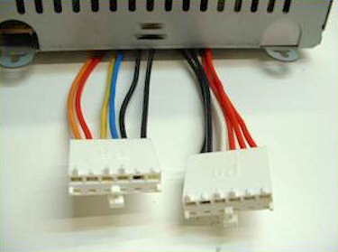
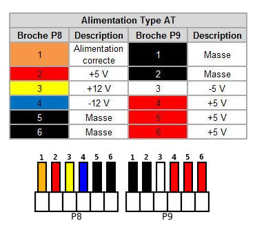
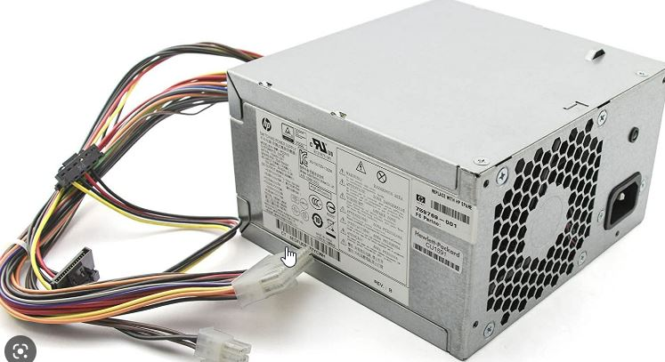
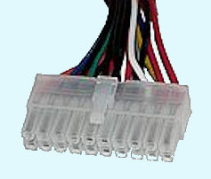
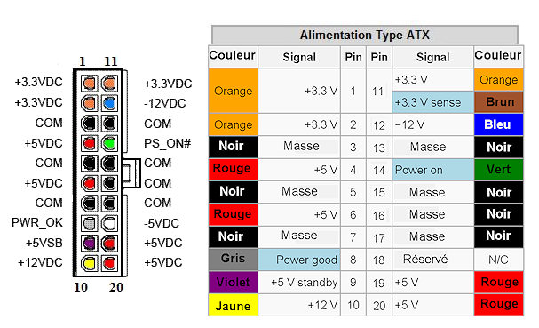

# Alimentation

## Format de boitier d'Alim

### Format AT

Ancien standard PC qui a commencé à disparaître autour de 1998. C'est une alimentation à découpage simple munie d'un interrupteur qui agit directement sur l'alimentation secteur : si vous le basculez, le ventilateur de l'alim se met en marche. Il vaut mieux tout de même charger le circuit de tension +5V avec une résistance (petite en valeur mais puissante) pour que les autres tensions soient correctement régulées. On les reconnaît à leur connecteur à **12 broches**.

Borchage du connecteur sur la carte mère

### Format ATX

Il est apparu progressivement aux alentours des années 1998-2000 et il est très répandu dans les PC actuels (2010). C'est une alimentation à découpage intelligente. Lors de sa mise sous tension par l'interrupteur arrière, elle ne démarre pas. Elle ne délivre qu'un +5V de faible ampérage à la carte mère (qui passe en standby). Le démarrage complet s'effectue grâce au signal délivré par la carte mère (Power ON) lorsque l'on agit sur l'interrupteur en face avant du PC. Le +5V nécessite aussi une charge (résistance) pour assurer la mise en puissance (on peut aussi "charger" le +12V avec une R plus grosse et qui correspond environ à la R d'un disque dur). On les reconnaît à leur connecteur à **20 broches**.

Borchage du connecteur sur la carte mère

### Format ATX12V

Nouveau standard autour des années 2010, identique à l'ATX mais avec des connecteurs PCI Express et +12V supplémentaires pour la carte mère. On les reconnaît à leur connecteur à **24 broches**.

## Boitier d'alimentation

- Alimentation ATX (AT Extended): Mise à jour de l'ancien modèle, mais obsolète
- Alimentation ATX12V : Alimentation actuellement répandue.
- Alimentation ESP12V : Plutôt utilisé sur les serveur mais également sur les PC bureautique haute performance.

## Tension d'alimentation

- 3,5V et 5,5V utilisé pour les circuite.
- Le 12V pour les moteur.
