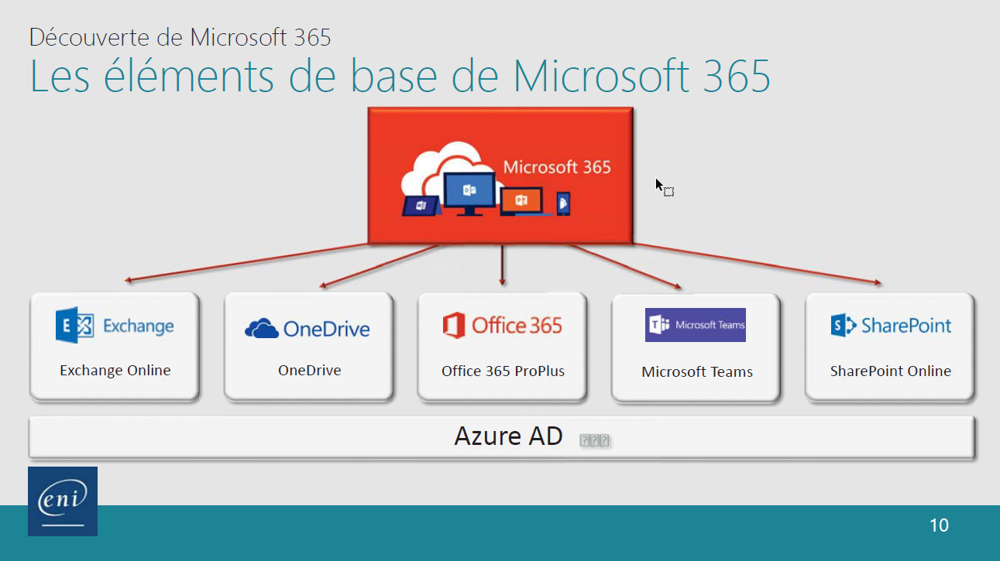
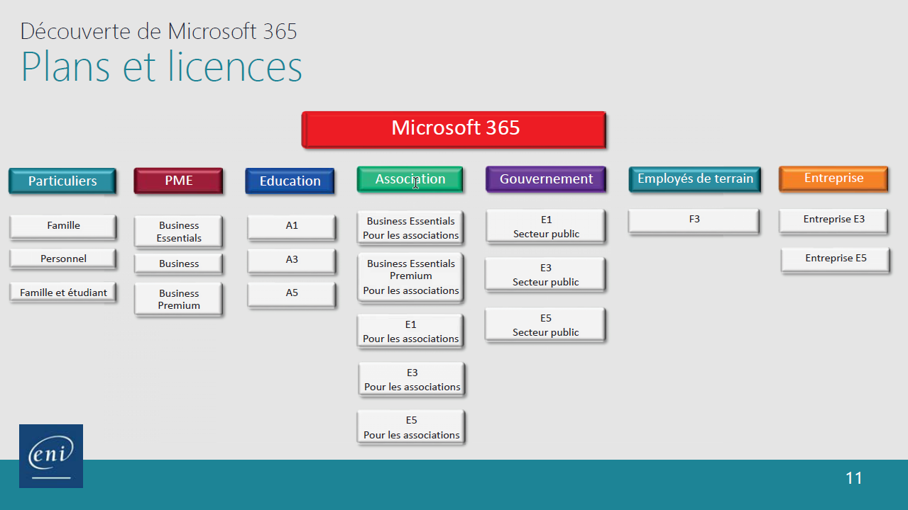
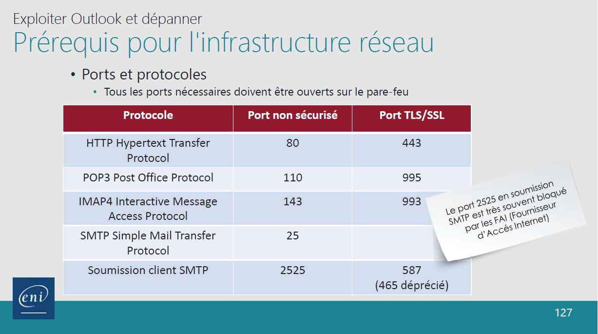
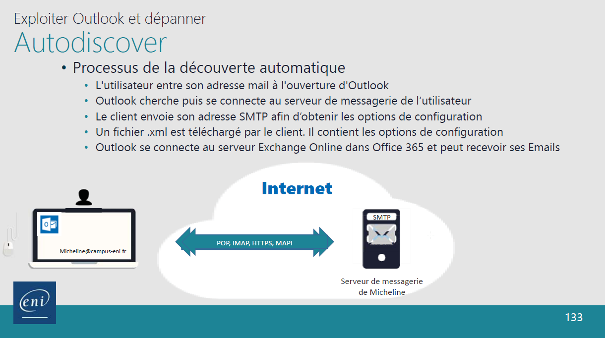
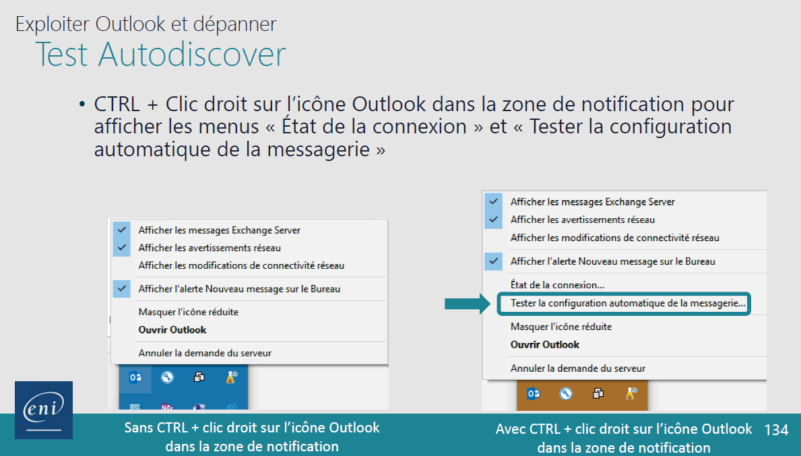

# Outils Collaboratif

[Retour Sommaire](../README.md)

## Vocabulaire

- **S**oftaware **a**s **a** **S**ervice **(SaaS)** : (Logiciel en tant que service), est un modèle d'exploitation commerciale des logiciels dans lequel ceux-ci sont installé sur des serveurs distants plutôt que sur la machine utilisateur. Les clients paye généralement un abonnement.
- **Un Tenant** : C'est l'ensemble des services de **Votre** abonnement dans Microsoft 365 associé à votre domaine pour **Votre** entreprise.
- **Microsoft Exchange Server** : est un groupware pour serveur de messagerie électronique.
- **groupware** : Un groupware, collecticiel, ou encore logiciel de groupe, est un **type de logiciel qui permet à un groupe de personnes de partager des documents à distance pour favoriser le travail collaboratif.**
- [**Cryptage vs Chiffrage**](https://www.primx.eu/fr/abc-chiffrement/chiffrement-vs-cryptage-quelles-differences/#:~:text=Le%20terme%20de%20cryptage%20et,revient%20%C3%A0%20d%C3%A9coder%20sans%20cl%C3%A9.)
- **DG** : Directeur Général
- [**Code HTTP**](https://fr.wikipedia.org/wiki/Liste_des_codes_HTTP)

## Objectifs

- Expliquer l'utilisation des outils de communication asynchrone (messagerie électronique...)
- Expliquer l'utilisation des outils de communication synchrone (Teams, Onedrive)
- Expliquer l'utilisation d'un outil bureautique collaboratif
- Rédiger et transmettre des notes, consignes, et procédures en tenant compte des besoins du destinataire.

## Concurrent

- [ZOHO](https://www.zoho.com/fr/?utm_source=zohocorp&utm_medium=referral&utm_campaign=internal)
- [HyperOffice](https://www.hyperoffice.com/)
- [G-Suite](https://workspace.google.com/)
- [Amazon Web Services](https://aws.amazon.com/fr/?nc2=h_lg)
- [IBM Cloud](https://www.ibm.com/fr-fr/cloud)

## Qu'est ce que Microsoft 365

- Offre Cloud : Multiple applications (Exchange, SharePoint, Office...)
- Multi-Plateforme
- S'adresse aux particuliers et aux entreprises
- Moins de serveurs sur site.
- Quelques chiffres:
  - Microsoft Teams passe la barre des 75 millions d'utilisateur actifs par jour fin mai 2020 (lié au Covid.)
  - Quatre datacenters en France

## Les éléments de base de Microsoft 365

Comme indiqué les différent logiciel font partie d'Azure AD

## Les licences de Microsoft 365

## SharePoint Online

SharePoint Online est le noyau central.

## Création d'un Tenant Microsoft 365

1. Sélectionner un plan. Ex : Famille, A1, E5, F3
2. Fournissez une adresse mail valide ex: prenom.nomannee@campus-eni.fr
3. Entrer les données de votre entreprise. Ex : nom et nombre de salarié.
4. Choisissez le nom de votre Tenant. Ex: admin@monEntreprise.onmicrosoft.com
5. Valider

## TEAMS

Item    | Hello
|-------|----|
Article |ffff

## Excel

### Raccourci

- **Alt+=** : Fait appel à la fonction Somme automatique.

### Fonctions

- **ALEA.ENTRE.BORNES(min; max)** : Créer un nombre aléatoire entre deux chiffre ex: entre 0 et 10 -> ALEA.ENTRE.BORNES(0; 10)

## Outlook

### Protocole

- **SMTP** :
  - **DEF** : Protocole de soumission de mail
  - **Protocole Gestion de mail** : IMAP ou POP, ActiveSync, ou HTTPS, MAPI, etc

**Liste protocole avec ports par défaut** | **Autodiscover** | **Test Autodiscover**|
|--|--|--|
 |  | 

### id Les port TLS/SSL chiffre les donnée mais n'est pas du cryptage {#id}
